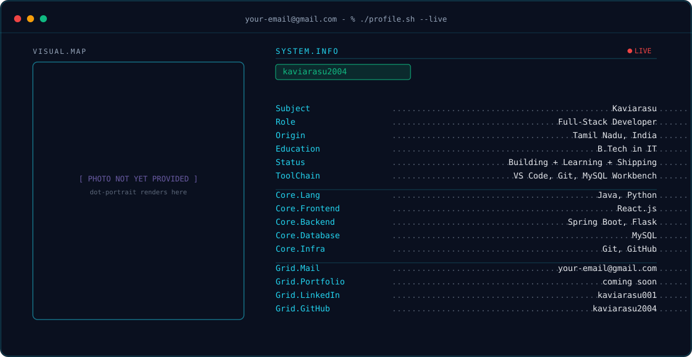

# Hi, I'm Kaviarasu

<picture>
  <source media="(prefers-color-scheme: dark)" srcset="dark.svg">
  <source media="(prefers-color-scheme: light)" srcset="light.svg">
  
</picture>

<!--
  This banner is a placeholder for the portrait. The dot-portrait
  (Phase 1 of the master prompt) needs your actual photo run through the
  dithering/segmentation pipeline -- it hasn't been generated yet.
  Everything else (terminal frame, SYSTEM.INFO panel, dotted leaders,
  LIVE badge, handle pill) is live and already reflects your real info.
-->
